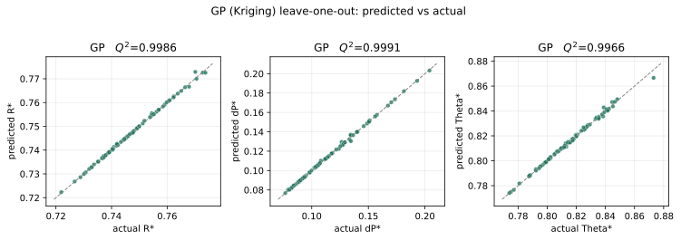
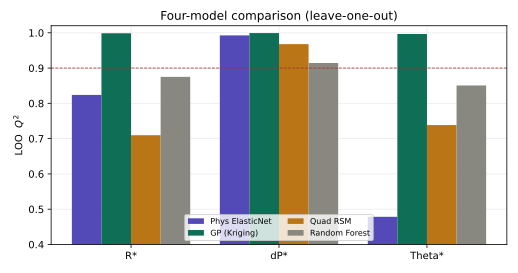
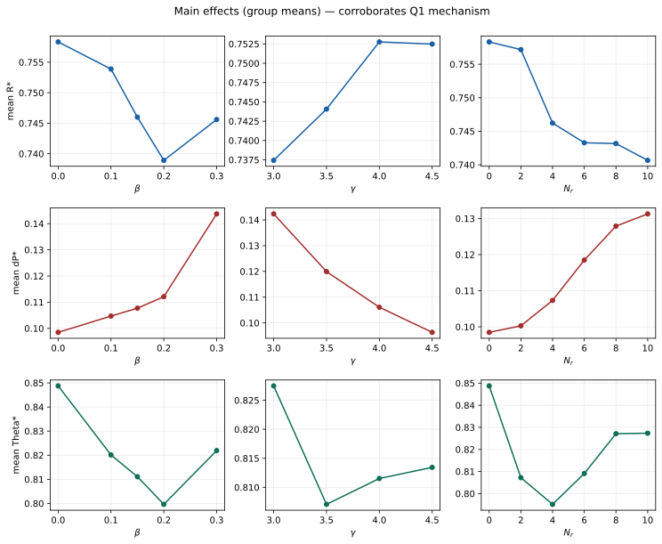

# 问题二论文草稿：基于高斯过程回归的芯片热管理性能代理模型

在问题一中，我们从传热、流阻和温度均匀性的物理机制出发，分析了针肋宽度比 $\beta$、歧管深高比 $\gamma$ 和针肋排数 $N_r$ 对无量纲热阻 $R^*$、无量纲压降 $\Delta P^*$ 以及温度非均匀性 $\Theta^*$ 的影响。问题二进一步要求在有限样本数据基础上建立可用于预测和后续优化的代理模型。由于附件 2 中仅包含 84 组结构参数与性能指标结果，样本规模较小，而三个响应指标随结构参数变化呈现明显非线性关系，因此本文采用高斯过程回归（Gaussian Process Regression, GPR，又称 Kriging）作为主要代理模型。

## 1 高斯过程回归原理

高斯过程回归可以理解为一种“由样本相似性决定预测值”的非参数回归方法。设结构参数向量为

$$
\boldsymbol{x}=(\beta,\gamma,N_r)^{\mathrm T},
$$

目标响应为 $y$。对于本题，$y$ 分别对应 $R^*$、$\Delta P^*$ 和 $\Theta^*$。高斯过程假设未知响应函数 $f(\boldsymbol{x})$ 服从一个由均值函数和协方差函数共同决定的随机过程：

$$
f(\boldsymbol{x})\sim GP\left(m(\boldsymbol{x}),k(\boldsymbol{x},\boldsymbol{x}')\right).
$$

其中 $m(\boldsymbol{x})$ 表示先验均值，$k(\boldsymbol{x},\boldsymbol{x}')$ 为核函数，用于刻画两个结构方案之间的相似程度。若两个输入点在标准化后的参数空间中距离较近，则核函数值较大，说明二者性能响应更可能接近；反之，核函数值较小。

给定训练样本 $X=[\boldsymbol{x}_1,\ldots,\boldsymbol{x}_n]^{\mathrm T}$ 及对应响应 $\boldsymbol{y}$，对于新的结构方案 $\boldsymbol{x}_*$，高斯过程的预测均值可写为

$$
\hat y(\boldsymbol{x}_*)=
\boldsymbol{k}_*^{\mathrm T}\left(K+\sigma_n^2I\right)^{-1}\boldsymbol{y},
$$

其中 $K$ 是训练样本两两之间的核矩阵，$\boldsymbol{k}_*$ 是新样本与所有训练样本之间的核向量，$\sigma_n^2I$ 表示噪声或数值稳定项。由此可见，高斯过程的预测值本质上是训练样本响应值的加权组合，权重由新方案与已有样本之间的相似性自动确定。

相比普通多项式回归，高斯过程不需要预先指定全局函数形式，能够较好拟合小样本下的非线性响应曲面；相比随机森林，高斯过程给出的响应面更平滑，更适合后续进行连续变量搜索和多目标优化。因此，高斯过程适合作为第三问和第五问进一步优化分析的代理模型。

## 2 本文的 GP 建模过程

本文将三个结构参数作为统一输入：

$$
X=(\beta,\gamma,N_r),
$$

并对三个性能指标分别建立独立的高斯过程代理模型：

$$
\begin{aligned}
GP_R &: (\beta,\gamma,N_r)\mapsto R^*,\\
GP_P &: (\beta,\gamma,N_r)\mapsto \Delta P^*,\\
GP_T &: (\beta,\gamma,N_r)\mapsto \Theta^*.
\end{aligned}
$$

之所以分别建模，是因为三个指标的物理含义、数值范围和变化规律不同。分别训练可以使每个代理模型针对自身响应曲面自适应地确定核函数参数，避免不同指标之间的量纲差异相互干扰。

具体实现时，首先读取附件 2 中的 84 组样本，并提取 $\beta,\gamma,N_r$ 作为输入矩阵。由于三个输入变量的数值尺度不同，其中 $\beta$ 位于 $0$ 到 $0.3$ 附近，$\gamma$ 位于 $3$ 到 $4.5$ 附近，而 $N_r$ 取 $0,2,4,6,8,10$ 等离散水平，若直接建模会使数值范围较大的变量在距离计算中占据更大权重。因此，本文在训练高斯过程前先对输入变量进行标准化处理，使三个参数在相近尺度下参与核函数计算。

核函数选用常数核、Matérn 核与白噪声核的组合：

$$
k(\boldsymbol{x},\boldsymbol{x}')
=
\sigma_f^2 k_{\mathrm{Matern},5/2}(\boldsymbol{x},\boldsymbol{x}')
+\sigma_n^2\delta(\boldsymbol{x},\boldsymbol{x}').
$$

其中 Matérn 核的光滑度参数取 $\nu=2.5$。该核函数比平方指数核稍弱一些平滑性假设，更适合刻画工程响应曲面中由针肋扰流、局部阻塞和歧管分流共同造成的非线性变化。白噪声核用于吸收数值仿真或样本记录中可能存在的小幅误差，同时增强核矩阵求逆时的稳定性。

为了客观评估模型泛化能力，本文采用统一的留一交叉验证（Leave-One-Out, LOO）。对于每一个模型和每一个指标，依次取 83 个样本训练模型，用剩余 1 个样本测试，重复 84 次，得到全部样本的留一预测值。评价指标包括训练集 $R^2$、留一交叉验证 $Q^2$、均方根误差 RMSE 和平均绝对误差 MAE，其中

$$
Q^2_{\mathrm{LOO}}=1-\frac{\sum_{i=1}^{n}(y_i-\hat y_{-i})^2}
{\sum_{i=1}^{n}(y_i-\bar y)^2}.
$$

式中 $\hat y_{-i}$ 表示第 $i$ 个样本未参与训练时得到的预测值。$Q^2_{\mathrm{LOO}}$ 越接近 1，说明模型对未见样本的预测能力越强。

## 3 结果与精度分析

基于第 2 节建立的三个 GP 代理模型，本文首先对 84 组样本进行留一预测，以检验高斯过程在未见样本上的拟合能力。结果表明，GP 对三个性能指标均能给出较高精度的预测：对于 $R^*$，$Q^2_{\mathrm{LOO}}$ 达到 0.9986，RMSE 为 0.00042；对于 $\Delta P^*$，$Q^2_{\mathrm{LOO}}$ 达到 0.9991，RMSE 为 0.00081；对于 $\Theta^*$，$Q^2_{\mathrm{LOO}}$ 达到 0.9966，RMSE 为 0.00112。三个指标的 $Q^2_{\mathrm{LOO}}$ 均接近 1，说明 GP 代理模型能够在小样本条件下较好恢复附件 2 所给出的非线性响应关系。

图 1 给出了 GP 模型留一预测值与真实值的散点关系。三个子图中的散点均紧密分布在 $y=x$ 参考线附近，说明对于每一个被留出的样本，GP 仍能够利用其余 83 个样本给出准确预测。这表明 GP 并非仅在训练集上插值表现良好，而是在留一验证意义下具有较强的局部泛化能力。

为了进一步说明上述精度并非偶然，本文还在相同数据划分和评价标准下构建了物理特征弹性网、二次响应面和随机森林三类对照模型，并将它们与 GP 的预测结果进行比较。表 1 给出了四类代理模型在三个性能指标上的统一留一验证 $Q^2$。可以看到，高斯过程模型在三个指标上均取得最高的 $Q^2_{\mathrm{LOO}}$，尤其是在温度非均匀性 $\Theta^*$ 上，相比物理特征弹性网和二次响应面模型具有更明显优势。

**表 1 四类代理模型的留一交叉验证 $Q^2$ 对比**

| 模型 | $R^*$ | $\Delta P^*$ | $\Theta^*$ |
|---|---:|---:|---:|
| PhysElasticNet | 0.8239 | 0.9927 | 0.4785 |
| **GP_Kriging** | **0.9986** | **0.9991** | **0.9966** |
| QuadRSM | 0.7098 | 0.9678 | 0.7385 |
| RandomForest | 0.8752 | 0.9143 | 0.8507 |

图 2 以雷达图形式进一步展示了四类模型在三个指标上的 $Q^2_{\mathrm{LOO}}$ 对比。可以看到，GP 在三个指标上均显著高于二次响应面和随机森林模型；物理特征弹性网在 $\Delta P^*$ 上表现较好，但在 $\Theta^*$ 上精度不足，说明温度非均匀性受局部换热与流动分配共同影响，简单线性组合难以充分描述其非线性响应。

从物理解释角度看，随机森林的重要度结果也与问题一的机理判断基本一致。对于 $R^*$，$\gamma$ 和 $N_r$ 的重要度较高，说明歧管分配和针肋排数共同影响热阻；对于 $\Delta P^*$，$\gamma$ 与 $\beta$ 的重要度较高，说明歧管高度分配和针肋阻塞是压降变化的主要来源；对于 $\Theta^*$，$N_r$ 和 $\beta$ 的重要度更突出，反映针肋布置对局部温度均匀性的影响较强。图 3 中各变量的主效应曲线也从数据层面对上述趋势进行了补充说明。

## 4 与其他代理模型的比较

上述对比结果表明，GP 在三个响应指标上均具有最优的留一预测精度。为进一步解释不同模型精度差异的来源，本文对三类对照模型的特点作如下分析。

第一类是物理特征弹性网模型，其输入并非直接使用原始参数，而是结合问题一机理构造了 $1/\gamma$、$1/\gamma^2$、扰流强化项、阻塞项、$N_r$、$\beta^2$ 和 $\beta N_r$ 等特征。该模型可解释性较强，尤其能较好描述压降指标，但由于模型本质上仍是线性组合，对复杂非线性响应的刻画能力有限。

第二类是二次响应面模型。该方法是经典试验设计中的常用近似形式，能够描述二次项和两两交互项，但面对针肋扰流、歧管分配和局部阻塞共同耦合形成的响应曲面时，固定二次函数形式偏弱，因此三个指标的留一验证精度均低于 GP。

第三类是随机森林模型。随机森林能够捕捉非线性关系，并可给出变量重要度，但其预测面通常呈分段常数或分段不光滑形态，不适合作为后续连续优化的主代理模型。从表 1 和图 2 可知，随机森林虽然在训练集上具有较高 $R^2$，但留一验证误差明显高于 GP。

综合比较可知，GP 在精度、平滑性和后续优化可用性之间取得了最佳平衡。因此，本文选取 GP_Kriging 作为问题二的最终代理模型，并使用全部 84 组样本重新训练最终模型，保存为后续问题三多目标优化和问题五敏感性分析的统一预测工具。
