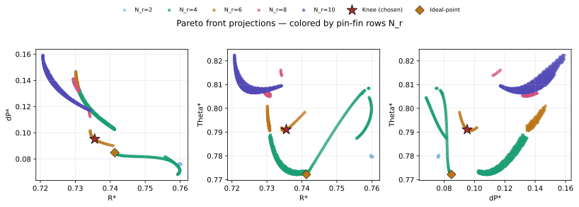
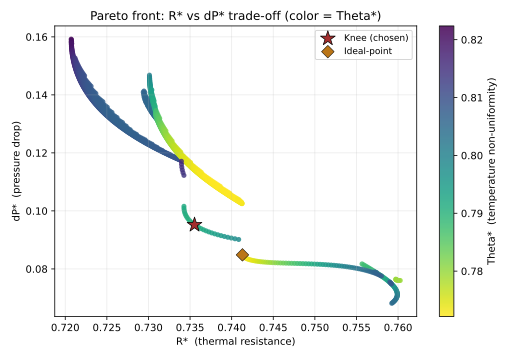

# 问题三论文草稿：基于 Pareto 前沿与膝点法的芯片热管理结构多目标优化

在问题二中，本文已经基于附件 2 的 84 组样本建立了高精度高斯过程代理模型，分别刻画结构参数 $(\beta,\gamma,N_r)$ 与无量纲热阻 $R^*$、无量纲压降 $\Delta P^*$ 以及温度非均匀性 $\Theta^*$ 之间的非线性映射关系。问题三进一步要求在给定设计域内寻找综合性能最优的芯片热管理结构。由于三个性能指标均为越小越好，但它们之间存在明显冲突：增强扰流和增加针肋排数有利于降低热阻，却通常会提高流动阻力；改善流动分配有助于温度均匀性，但也可能改变局部换热与压降之间的平衡。因此，问题三本质上是一个三目标优化问题。

本文没有将三个目标简单合成为单一加权指标，而是先在设计域内求出 Pareto 非支配前沿，再利用膝点法从前沿中选择几何意义上最均衡的折中解。这样可以避免人为指定权重带来的主观性，并为第四问进一步讨论权重偏好变化提供一个客观基准。

## 1 多目标优化模型

设结构参数向量为

$$
\boldsymbol{x}=(\beta,\gamma,N_r)^{\mathrm T},
$$

其中 $\beta$ 为针肋宽度比，$\gamma$ 为歧管深高比，$N_r$ 为针肋排数。根据题目数据范围和实际可制造性，本文将设计域限定为

$$
0\leq \beta \leq 0.30,\qquad
3.0\leq \gamma \leq 4.5,\qquad
N_r\in\{0,2,4,6,8,10\}.
$$

由问题二得到的高斯过程代理模型分别记为

$$
\begin{aligned}
\hat R(\boldsymbol{x}) &: (\beta,\gamma,N_r)\mapsto R^*,\\
\hat P(\boldsymbol{x}) &: (\beta,\gamma,N_r)\mapsto \Delta P^*,\\
\hat T(\boldsymbol{x}) &: (\beta,\gamma,N_r)\mapsto \Theta^*.
\end{aligned}
$$

于是问题三可写为如下三目标最小化模型：

$$
\min_{\boldsymbol{x}}
\boldsymbol{F}(\boldsymbol{x})
=
\left(
\hat R(\boldsymbol{x}),
\hat P(\boldsymbol{x}),
\hat T(\boldsymbol{x})
\right),
$$

其中三个目标分别表示降低热阻、降低压降和改善温度均匀性。由于这三个目标并不能同时达到各自最小值，本文采用 Pareto 最优性描述可接受的折中方案。

对于任意两个方案 $\boldsymbol{x}_a$ 和 $\boldsymbol{x}_b$，若满足

$$
F_i(\boldsymbol{x}_a)\leq F_i(\boldsymbol{x}_b),\quad i=1,2,3,
$$

且至少存在一个指标严格小于，即

$$
\exists j,\quad F_j(\boldsymbol{x}_a)<F_j(\boldsymbol{x}_b),
$$

则称方案 $\boldsymbol{x}_a$ 支配方案 $\boldsymbol{x}_b$。若某一方案不被设计域内任何其他方案支配，则该方案为 Pareto 非支配解。所有非支配解构成 Pareto 前沿。

## 2 求解方法

由于本题的决策变量只有三个，且 $N_r$ 为有限个离散档位，问题规模较小，因此本文采用网格穷举而非 NSGA-II 等启发式算法。具体地，将 $\beta$ 与 $\gamma$ 分别划分为 121 个等距网格点，$N_r$ 取 $0,2,4,6,8,10$ 六个实际档位，共得到

$$
121\times 121\times 6=87846
$$

个候选结构方案。对每个候选方案，调用问题二训练得到的 GP 代理模型预测 $R^*$、$\Delta P^*$ 和 $\Theta^*$，然后根据支配关系筛选非支配解。

选择网格穷举的原因有两点。第一，本题变量维度低、设计域小，GP 模型预测速度快，穷举计算完全可行；第二，穷举法不依赖随机种子和迭代收敛判据，结果具有较好的可复现性。对于数学建模论文而言，这比启发式算法更便于解释和复核。

在得到 Pareto 前沿后，还需要从非支配解中选出一个最终推荐方案。本文采用膝点法。膝点的含义是：在 Pareto 前沿上，继续改善任一指标都会导致其他指标明显恶化的位置，即综合权衡的转折点。由于三项指标数值范围不同，若直接计算几何距离，数值跨度较大的 $\Delta P^*$ 会主导结果。因此，本文先对 Pareto 前沿上的三个目标进行 min-max 归一化：

$$
F_i^{\mathrm{norm}}
=
\frac{F_i-F_i^{\min}}{F_i^{\max}-F_i^{\min}},
\qquad i=1,2,3.
$$

归一化后，三个目标均落在 $[0,1]$ 区间内，具有相同的几何权重。随后分别取使 $R^*$、$\Delta P^*$ 和 $\Theta^*$ 最小的三个极值解作为锚点，这三个锚点在归一化目标空间中张成一个极值平面。Pareto 前沿上距离该平面最远且朝向理想点一侧的解被定义为膝点。该方案代表了三个性能指标之间最均衡的客观折中。

为了检验膝点解的稳定性，本文还采用理想点法作为辅助交叉验证。理想点法将归一化后的原点 $(0,0,0)$ 视为三个目标同时达到最优的虚拟方案，并选择距离该点最近的 Pareto 解作为参考点。需要强调的是，理想点法在本文中不作为并列决策准则，仅用于判断膝点法给出的最终方案是否落在稳定的优选区域内。

## 3 Pareto 前沿结果分析

经过非支配筛选后，87846 个候选结构中共有 1365 个 Pareto 非支配解。各非支配解在目标空间中形成一组折中前沿，说明降低热阻、降低压降和改善温度均匀性之间存在不可忽略的竞争关系。

图 1 给出了 Pareto 前沿在三个目标平面上的两两投影，并按针肋排数 $N_r$ 进行着色。可以看到，前沿并不是单一连续曲面，而是由于 $N_r$ 的离散取值形成了若干分层曲线。其中 $N_r=4$ 和 $N_r=10$ 两个档位占据主要部分，分别包含 585 个和 579 个非支配解；$N_r=6$、$N_r=8$ 和 $N_r=2$ 的非支配解数量相对较少，分别为 109、83 和 9 个。

从图 1 可见，较大的针肋排数能够增强扰流和换热，因此 $N_r=10$ 对应的方案通常具有较低的 $R^*$，但其压降也明显较高。这说明单纯追求最低热阻会带来较大的流动代价。相反，$N_r=4$ 对应的方案更多分布在压降较低、温度均匀性较好的区域，是综合性能较均衡的候选集合。该现象与问题一中的物理分析一致：增加针肋排数可以提升换热能力，但也会增强通道阻塞和黏性耗散，从而使 $\Delta P^*$ 上升。

图 2 进一步突出展示 $R^*$ 与 $\Delta P^*$ 的主权衡关系，并用颜色表示第三个目标 $\Theta^*$。横轴越靠左表示热阻越低，纵轴越靠下表示压降越小，颜色则反映温度非均匀性大小。**（此处可以将这个图做成三维立体的，以更好地展示 Pareto 前沿的三维结构。）**

可以看到，Pareto 前沿整体呈现明显的反向权衡趋势：当 $R^*$ 降低时，$\Delta P^*$ 往往升高；当压降被压低时，热阻又会相应增大。这说明芯片热管理结构优化不能只考虑散热能力，也必须同时考虑泵功代价。图中的红色五角星为本文采用的膝点解，黄色菱形为理想点法得到的辅助参考点。二者均位于前沿的折中区域，而不是任一单目标极值端点，说明膝点法得到的最终推荐方案并未过度偏向某一个指标。

## 4 最优方案与物理解释

表 1 给出了本文在问题三中最终采用的综合最优方案。由于题目未给定三个目标之间的偏好权重，本文不将多个准则得到的结果并列作为“最优方案”，而是以膝点法作为唯一的决策准则，理想点法仅在表后作为稳定性说明。

**表 1 问题三最终推荐的综合最优方案**

| 准则 | $\beta$ | $\gamma$ | $N_r$ | $R^*$ | $\Delta P^*$ | $\Theta^*$ |
|---|---:|---:|---:|---:|---:|---:|
| 膝点法（采用） | 0.21 | 4.5 | 6 | 0.736 | 0.095 | 0.791 |

膝点法给出的最终推荐方案为

$$
\beta=0.21,\qquad \gamma=4.5,\qquad N_r=6.
$$

对应预测性能为

$$
R^*=0.7355,\qquad
\Delta P^*=0.0952,\qquad
\Theta^*=0.7911.
$$

作为辅助验证，理想点法得到的参考点为 $\beta=0.22,\gamma=4.5,N_r=4$，对应 $R^*=0.7413,\Delta P^*=0.0848,\Theta^*=0.7722$。该参考点与膝点解在参数空间中较为接近：二者的 $\beta$ 均位于 $0.21$ 至 $0.22$ 附近，$\gamma$ 均取设计域上界 $4.5$，$N_r$ 均处于中等排数范围。由此可见，综合优选区域较稳定，集中在 $\beta\approx0.21\sim0.22$、$\gamma=4.5$、$N_r=4\sim6$ 附近；但本文的最终可制造推荐方案仍采用膝点法给出的 $N_r=6$ 方案。

进一步比较各单目标最优点可以看出，最低热阻方案为 $\beta=0.2275,\gamma=3.0375,N_r=10$，其 $R^*$ 可降至 0.7207，但 $\Delta P^*$ 升至 0.1592，压降代价明显偏高；最低压降方案为 $\beta=0,\gamma=4.5,N_r=4$，其 $\Delta P^*$ 为 0.0681，但 $R^*$ 上升至 0.7592；最低温度非均匀性方案为 $\beta=0.2275,\gamma=3.5375,N_r=4$，其 $\Theta^*$ 为 0.7722，但压降也高于最终推荐方案。由此可见，任一单目标最优方案都不能兼顾三项性能，而膝点解在热阻、压降和温度均匀性之间取得了更稳定的综合折中。

从结构机理上看，$\beta\approx0.21$ 表明适度增大针肋宽度有利于强化换热，但过大的 $\beta$ 会导致流道阻塞增强；$\gamma=4.5$ 表明在题目给定的 $[3.0,4.5]$ 设计域内，较大的歧管深高比有利于降低流动阻力并改善供液分配；$N_r=4$ 至 $6$ 则说明中等针肋排数既能提供足够的扰流强化，又不会像 $N_r=10$ 那样引入过高压降。该结果与问题一的机理判断相吻合，即针肋强化换热和流动阻塞之间存在最优折中。

需要注意的是，$\gamma$ 的最优值落在设计域上界 $4.5$，只能说明在题目给定区间内较大的 $\gamma$ 表现更优，并不能据此外推认为 $\gamma>4.5$ 时仍会继续改善。由于代理模型仅在附件 2 的样本范围内具有可靠性，本文所有优化结论均限定在给定设计域内部。

综上，本文在问题三中基于问题二的 GP 代理模型，通过网格穷举获得 Pareto 前沿，并采用膝点法选取综合最优结构。最终推荐方案为

$$
(\beta,\gamma,N_r)=(0.21,4.5,6),
$$

其预测性能为 $R^*=0.7355$、$\Delta P^*=0.0952$、$\Theta^*=0.7911$。该方案避免了最低热阻方案的高压降问题，也避免了最低压降方案散热不足的问题，是三项性能之间较为均衡的结构设计。
