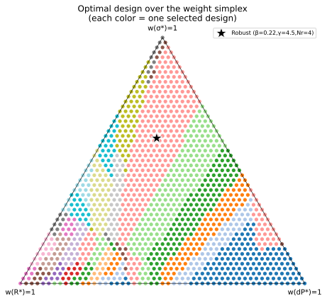
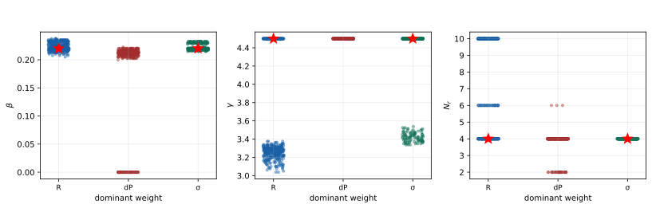

# 问题四论文草稿：基于权重单纯形扫描的芯片热管理鲁棒设计

在问题三中，本文基于问题二建立的高斯过程代理模型，构造了以无量纲热阻 $R^*$、无量纲压降 $\Delta P^*$ 和温度非均匀性 $\Theta^*$ 为目标的三目标优化模型，并通过 Pareto 前沿与膝点法得到综合折中方案。该方案不依赖人为指定权重，能够作为客观折中的基准。然而在实际工程设计中，不同应用场景对散热能力、泵功代价和温度均匀性的重视程度并不完全相同。例如高热流密度工况可能更重视降低热阻，而能耗受限场景可能更重视降低压降。因此，问题四进一步要求分析指标权重变化对最优设计的影响，并给出对偏好变化不敏感的鲁棒方案。

本文将第四问中的“不确定性”理解为决策偏好的变化，而不是结构参数或物理环境的随机扰动。具体而言，在问题三得到的 Pareto 非支配解集合上，对三项目标权重进行系统扫描；对于每一组权重，采用归一化加权和选择当前偏好下的最优方案；最后统计各方案在全部权重组合中被选为最优的比例，并以此定义鲁棒设计。该方法能够直接回答：当决策者在热阻、压降和温度均匀性之间改变偏好时，推荐结构是否仍然稳定。

## 1 权重敏感性模型

设结构参数向量仍为

$$
\boldsymbol{x}=(\beta,\gamma,N_r)^{\mathrm T},
$$

其中 $\beta$ 为针肋宽度比，$\gamma$ 为歧管深高比，$N_r$ 为针肋排数。由问题二得到的高斯过程代理模型可写为

$$
\boldsymbol{F}(\boldsymbol{x})
=
\left(
\hat R(\boldsymbol{x}),
\hat P(\boldsymbol{x}),
\hat T(\boldsymbol{x})
\right),
$$

分别对应 $R^*$、$\Delta P^*$ 和 $\Theta^*$。由于三个指标均为越小越好，且问题三已经筛选出 Pareto 非支配解集合 $\mathcal{P}$，问题四的优化不再在全部设计域中重复搜索，而是在 $\mathcal{P}$ 上讨论不同权重偏好下的最优选择。

令三项目标的权重向量为

$$
\boldsymbol{w}=(w_R,w_P,w_T)^{\mathrm T},
$$

其中

$$
w_R+w_P+w_T=1,\qquad
w_R,w_P,w_T\geq 0.
$$

所有满足上述约束的权重组合构成一个二维单纯形。单纯形的三个顶点分别表示完全重视热阻、完全重视压降和完全重视温度均匀性；内部点则表示三项目标之间的不同折中偏好。

由于 $R^*$、$\Delta P^*$ 和 $\Theta^*$ 的数值范围不同，若直接加权求和，数值跨度较大的指标会在综合目标中占据过高影响，从而使权重失去原本的偏好含义。因此，本文首先在 Pareto 前沿内部对三个目标分别进行 min-max 归一化：

$$
F_i^{\mathrm{norm}}(\boldsymbol{x})
=
\frac{F_i(\boldsymbol{x})-F_i^{\min}}
{F_i^{\max}-F_i^{\min}},
\qquad i=1,2,3.
$$

归一化后，三项目标均落入 $[0,1]$ 区间，且都保持“越小越优”的方向。对于任意权重 $\boldsymbol{w}$，定义综合评价函数

$$
S(\boldsymbol{x};\boldsymbol{w})
=
w_R R_{\mathrm{norm}}(\boldsymbol{x})
+w_P P_{\mathrm{norm}}(\boldsymbol{x})
+w_T T_{\mathrm{norm}}(\boldsymbol{x}).
$$

于是，在给定权重组合 $\boldsymbol{w}$ 下的最优方案为

$$
\boldsymbol{x}^*(\boldsymbol{w})
=
\arg\min_{\boldsymbol{x}\in\mathcal{P}}
S(\boldsymbol{x};\boldsymbol{w}).
$$

这个模型的含义是：先承认问题三得到的 Pareto 前沿代表了所有不可被同时改进的候选方案，再根据当前偏好从前沿中选出最符合需求的一个方案。

## 2 求解方法与鲁棒判据

本文在权重单纯形上采用等间距网格扫描。取步长为 $0.02$，生成满足 $w_R+w_P+w_T=1$ 的全部非负权重组合，共得到 1326 组权重。对于每一组权重，计算所有 Pareto 非支配解的归一化加权得分，并选择得分最小者作为该权重下的最优方案。

问题三中共得到 1365 个 Pareto 非支配解。由于候选方案数量和权重组合数量都较小，采用穷举扫描可以避免随机优化算法带来的初值依赖和收敛不确定性，使权重敏感性分析具有良好的可复现性。

为了刻画方案对偏好变化的鲁棒性，本文引入 win-share 指标。对于某一 Pareto 候选方案 $\boldsymbol{x}_j$，其 win-share 定义为该方案在全部权重组合中被选为最优的比例：

$$
\mathrm{WinShare}(\boldsymbol{x}_j)
=
\frac{
\#\{\boldsymbol{w}:\boldsymbol{x}^*(\boldsymbol{w})=\boldsymbol{x}_j\}
}{
\#\{\boldsymbol{w}\}
}.
$$

win-share 越高，说明该方案在越宽的权重偏好范围内都能成为最优，因此对决策偏好的变化越不敏感。本文将 win-share 最大的方案定义为问题四的鲁棒设计。与单一权重下的最优方案相比，该判据更强调“偏好范围上的稳定性”，而不是某一个预设场景下的极小值。

除整体 win-share 外，本文还设置四类典型权重场景进行对照：均衡权重 $(1/3,1/3,1/3)$，重热阻权重 $(0.6,0.2,0.2)$，重压降权重 $(0.2,0.6,0.2)$，以及重温度均匀性权重 $(0.2,0.2,0.6)$。这些场景用于观察当偏好明显偏向某一指标时，最优结构参数是否发生明显漂移。

## 3 权重单纯形结果分析

图 1 给出了权重单纯形上的最优解归属结果。图中每一个散点代表一组权重组合，三角形三个顶点分别对应 $w_R=1$、$w_P=1$ 和 $w_T=1$。每种颜色表示在该权重组合下被选中的同一个 Pareto 方案。若某一颜色占据区域较大，则说明该方案在较宽的偏好范围内均能取得最小加权得分。

从图 1 可以看出，权重空间并未被大量零散方案均匀切分，而是存在若干较集中的优选区域。其中黑色五角星标记的是本文定义的鲁棒方案所在区域的中心。该方案在全部 1326 组权重组合中具有最高的 win-share，说明它并不是只在某一个特殊权重下偶然最优，而是在相当宽的偏好范围内都能保持竞争力。

本文得到的鲁棒设计为

$$
\beta=0.22,\qquad
\gamma=4.5,\qquad
N_r=4.
$$

其预测性能为

$$
R^*=0.7413,\qquad
\Delta P^*=0.0848,\qquad
\Theta^*=0.7722,
$$

对应 win-share 为 19.5%。从单一方案占比来看，19.5% 已经是最高值，说明在三目标权重连续变化的情况下，该方案拥有最大的偏好适应区域。

进一步观察 win-share 前 5 名候选解可以发现，除一个低 $\beta$ 候选外，其余高占比方案均集中在 $\gamma=4.5$、$N_r=4$、$\beta\approx0.21\sim0.22$ 附近。具体而言，前几名方案包括 $(\beta,\gamma,N_r)=(0.22,4.5,4)$、$(0.2175,4.5,4)$、$(0.215,4.5,4)$ 和 $(0.2125,4.5,4)$。这说明鲁棒优选区域并非单点孤立，而是在参数空间中形成了一个较稳定的小邻域。

## 4 参数漂移与典型场景比较

为了进一步分析权重变化如何影响结构参数，图 2 按每组权重中的最大分量将偏好分为三类：热阻主导、压降主导和温度均匀性主导。三个子图分别展示被选中方案的 $\beta$、$\gamma$ 和 $N_r$ 随主导偏好的变化情况。

从图 2 可以看出，$N_r$ 对权重变化最不敏感，绝大多数情况下稳定为 4。这说明在本文给定设计域和代理模型下，中等偏少的针肋排数能够在降低压降和保持温度均匀性之间取得稳定折中。若继续增加 $N_r$，虽然可能进一步增强换热，但也会显著增加流动阻力，因此只有在极端重视热阻时才更有可能被选中。

$\gamma$ 的变化具有更明确的物理含义。在重压降和重温度均匀性的场景中，最优解通常保持 $\gamma=4.5$，即设计域上界。这说明较大的歧管深高比有利于降低流动阻力并改善供液分配，使压降和均匀性表现较优。而当权重明显偏向热阻时，最优 $\gamma$ 会下移至约 3.25。较小的 $\gamma$ 对应相对更强的微通道换热能力，因此可以降低热阻，但其代价是压降明显升高。

$\beta$ 的漂移幅度相对较小，主要集中在 $0.21$ 至 $0.23$ 附近。该结果说明适度的针肋宽度比有利于形成扰流强化换热，但过大的针肋宽度会导致阻塞效应增强，过小的针肋宽度又难以提供足够的换热增强。因此，在不同权重偏好下，$\beta$ 的优选区间均保持在中等偏高水平。

表 1 给出了四类典型权重场景下的最优方案。可以看到，均衡、重压降和重温度均匀性三种场景均选择了 $\gamma=4.5$、$N_r=4$，且 $\beta$ 均位于 $0.21$ 至 $0.22$ 附近；只有重热阻场景下，$\gamma$ 下降至 3.25，$\beta$ 增至 0.23，压降也随之升高。

**表 1 典型权重场景下的最优方案**

| 权重场景 | $\beta$ | $\gamma$ | $N_r$ | $R^*$ | $\Delta P^*$ | $\Theta^*$ |
|---|---:|---:|---:|---:|---:|---:|
| 均衡 $(1/3,1/3,1/3)$ | 0.2175 | 4.5 | 4 | 0.7413 | 0.0846 | 0.7722 |
| 重热阻 $(0.6,0.2,0.2)$ | 0.2300 | 3.25 | 4 | 0.7337 | 0.1197 | 0.7761 |
| 重压降 $(0.2,0.6,0.2)$ | 0.2100 | 4.5 | 4 | 0.7416 | 0.0839 | 0.7727 |
| 重均匀性 $(0.2,0.2,0.6)$ | 0.2200 | 4.5 | 4 | 0.7413 | 0.0848 | 0.7722 |

由表 1 可见，偏重热阻时，$R^*$ 从鲁棒方案的 0.7413 降至 0.7337，但 $\Delta P^*$ 从 0.0848 升至 0.1197，压降代价较为明显。这再次说明三目标之间存在不可忽略的权衡关系。相比之下，重压降和重均匀性场景下的最优解与鲁棒设计非常接近，说明鲁棒方案在降低压降和保持温度均匀性方面具有较强稳定性。

## 5 鲁棒方案与问题三结果的关系

问题三采用膝点法得到的综合推荐方案为 $(\beta,\gamma,N_r)=(0.21,4.5,6)$，而问题三中的理想点辅助参考方案为 $(0.22,4.5,4)$。问题四得到的鲁棒设计正是

$$
(\beta,\gamma,N_r)=(0.22,4.5,4),
$$

与问题三的理想点参考方案一致，并且与膝点方案同处于 $\beta\approx0.21\sim0.22$、$\gamma=4.5$、$N_r=4\sim6$ 的稳定优选区域。这说明问题三的客观多目标优化和问题四的偏好敏感性分析并不矛盾：前者强调在 Pareto 前沿几何形态上的均衡折中，后者强调在权重偏好变化下的选择稳定性。

从工程设计角度看，如果设计者希望得到一个不依赖具体权重设定、并能在多数偏好场景下保持较优表现的方案，则问题四的鲁棒设计更适合作为最终推荐。该方案的热阻略高于问题三膝点方案，但压降更低、温度均匀性更好，且在权重空间中拥有最大的适用区域。因此，本文将

$$
\beta=0.22,\qquad
\gamma=4.5,\qquad
N_r=4
$$

作为对指标权重变化最不敏感的鲁棒设计方案。

需要强调的是，本文的鲁棒性是针对目标权重偏好的鲁棒性，而不是针对制造误差、入口流量波动或热流密度波动的物理鲁棒性。若进一步考虑结构参数扰动或工况不确定性，还需要在当前 GP 代理模型基础上引入随机采样或可靠性约束。尽管如此，问题四的结果已经表明，在题目给定设计域内，优选结构高度集中于 $\gamma=4.5$、$N_r=4$ 和 $\beta\approx0.21\sim0.22$ 附近，说明该区域具有较强的偏好稳定性。

综上，本文通过权重单纯形扫描分析了三项目标权重变化对最优设计的影响，并以 win-share 最大化定义鲁棒方案。结果表明，鲁棒设计为

$$
(\beta,\gamma,N_r)=(0.22,4.5,4),
$$

其预测性能为 $R^*=0.7413$、$\Delta P^*=0.0848$、$\Theta^*=0.7722$，在全部权重组合中的 win-share 为 19.5%。该方案在均衡、重压降和重温度均匀性场景下均表现稳定，只有在显著偏重热阻时最优结构才向较低 $\gamma$ 方向漂移。因此，该方案可作为芯片歧管式微通道热管理系统面对不同评价偏好时的鲁棒设计。
