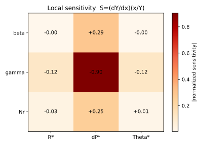
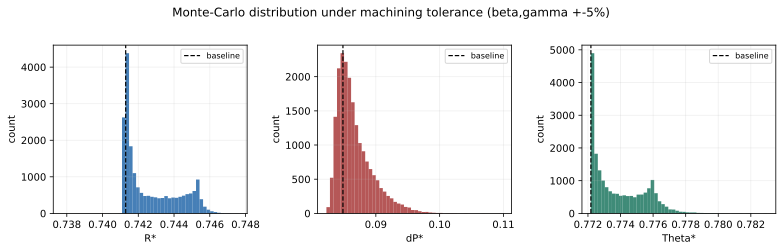
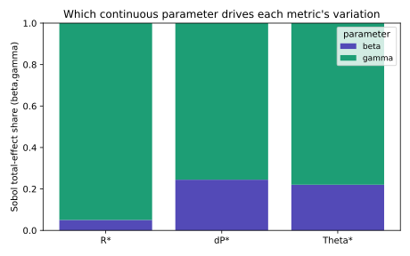

# 问题五论文草稿：基于参数扰动的芯片热管理结构敏感性与稳定性分析

在问题三中，本文基于高斯过程代理模型与 Pareto 前沿得到了综合折中方案；在问题四中，进一步通过权重单纯形扫描得到了对指标偏好变化最不敏感的鲁棒设计。该鲁棒方案为

$$
(\beta,\gamma,N_r)=(0.22,4.5,4),
$$

其预测性能为 $R^*=0.7413$、$\Delta P^*=0.0848$、$\Theta^*=0.7722$。问题五进一步关注：当结构参数存在加工误差或小幅扰动时，上述推荐方案的热阻、压降和温度均匀性是否仍能保持稳定。

本文将问题五中的扰动理解为结构制造误差引起的参数波动。由于针肋宽度比 $\beta$ 和歧管深高比 $\gamma$ 对应连续几何尺寸，加工误差可以自然表示为连续扰动；而针肋排数 $N_r$ 是制造时确定的整数结构变量，不会出现连续意义上的“非整数排数”。因此，本文对 $\beta$ 和 $\gamma$ 进行局部灵敏度、蒙特卡洛和 Sobol 方差分解分析，并将 $N_r$ 作为离散变量单独进行少两排和多两排的稳健性检查。

## 1 参数扰动模型

设待评估结构方案为

$$
\boldsymbol{x}_0=(\beta_0,\gamma_0,N_{r0})^{\mathrm T}
=(0.22,4.5,4)^{\mathrm T}.
$$

由问题二得到的高斯过程代理模型可写为

$$
\boldsymbol{F}(\boldsymbol{x})
=
\left(
\hat R(\boldsymbol{x}),
\hat P(\boldsymbol{x}),
\hat T(\boldsymbol{x})
\right),
$$

其中 $\hat R$、$\hat P$ 和 $\hat T$ 分别预测无量纲热阻 $R^*$、无量纲压降 $\Delta P^*$ 和温度非均匀性 $\Theta^*$。在基准点 $\boldsymbol{x}_0$ 处，代理模型给出的性能为

$$
R^*=0.7413,\qquad
\Delta P^*=0.0848,\qquad
\Theta^*=0.7722.
$$

为了比较不同参数对不同指标的影响强弱，本文首先采用归一化局部灵敏度：

$$
S_{ij}
=
\frac{\partial F_i}{\partial x_j}
\frac{x_j}{F_i},
$$

其中 $F_i$ 表示第 $i$ 个性能指标，$x_j$ 表示第 $j$ 个结构参数。该指标表示当某一参数发生相对小扰动时，性能指标的相对变化程度。$|S_{ij}|$ 越大，说明该指标对该参数越敏感；$S_{ij}$ 的正负号则表示扰动方向与指标变化方向的关系。

对于连续制造误差，本文假设 $\beta$ 和 $\gamma$ 均服从以基准值为均值、相对标准差为 $5\%$ 的高斯扰动：

$$
\beta=\beta_0(1+\varepsilon_\beta),\qquad
\gamma=\gamma_0(1+\varepsilon_\gamma),
$$

其中

$$
\varepsilon_\beta,\varepsilon_\gamma\sim N(0,0.05^2).
$$

扰动后的参数仍限制在题目给定设计域内，即 $0\leq\beta\leq0.30$、$3.0\leq\gamma\leq4.5$。在蒙特卡洛分析中，本文抽取 20000 组扰动样本，并通过 GP 代理模型计算三项性能指标的分布。为了进一步判断性能波动主要由哪个连续参数引起，本文还在 $\beta$ 和 $\gamma$ 的扰动范围内进行 Sobol 总效应分析。

## 2 局部灵敏度分析

表 1 给出了基准方案附近的归一化局部灵敏度。可以看到，$\gamma$ 对三项指标均表现出更强影响，尤其对压降 $\Delta P^*$ 的归一化灵敏度达到 $-0.904$。这说明在基准方案附近，若 $\gamma$ 增大，压降会明显降低；反过来，若制造误差导致实际 $\gamma$ 偏小，则压降会显著升高。

**表 1 基准方案处的归一化局部灵敏度**

| 参数 | 对 $R^*$ | 对 $\Delta P^*$ | 对 $\Theta^*$ |
|---|---:|---:|---:|
| $\beta$ | -0.004 | 0.287 | -0.003 |
| $\gamma$ | -0.119 | -0.904 | -0.121 |
| $N_r$ | -0.034 | 0.249 | 0.014 |

由图 1 可见，热阻 $R^*$ 和温度非均匀性 $\Theta^*$ 对连续参数扰动都不十分敏感，二者的主要敏感方向均来自 $\gamma$，但灵敏度绝对值仅约为 0.12。相比之下，压降 $\Delta P^*$ 对 $\gamma$ 的变化最为敏感，并且对 $\beta$ 也存在一定正向敏感性。这与问题一中的物理判断一致：歧管深高比直接影响流动通道尺度和分流阻力，而针肋宽度比会改变局部阻塞程度，因此二者对压降的影响比对热阻和温度均匀性的影响更明显。

需要说明的是，表 1 中 $N_r$ 的结果来自 $\pm2$ 排的离散差分，仅用于判断增加或减少针肋排数的变化趋势，不将其视为连续制造误差下的微分灵敏度。

## 3 蒙特卡洛稳定性分析

在 $\beta$ 和 $\gamma$ 均存在 $5\%$ 相对标准差扰动、$N_r$ 固定为 4 的条件下，本文进行 20000 次蒙特卡洛模拟。三个性能指标的统计结果如表 2 所示。

**表 2 连续加工扰动下的蒙特卡洛统计结果**

| 指标 | 均值 | 标准差 | CV | 95 分位 | 最坏值 |
|---|---:|---:|---:|---:|---:|
| $R^*$ | 0.7427 | 0.0015 | 0.20% | 0.7454 | 0.7476 |
| $\Delta P^*$ | 0.0867 | 0.0028 | 3.23% | 0.0923 | 0.1099 |
| $\Theta^*$ | 0.7738 | 0.0016 | 0.21% | 0.7765 | 0.7830 |

从表 2 和图 2 可以看出，基准鲁棒方案在热阻和温度均匀性方面具有很强稳定性。$R^*$ 的变异系数仅为 0.20%，$\Theta^*$ 的变异系数仅为 0.21%，说明即使 $\beta$ 和 $\gamma$ 出现小幅加工波动，这两项指标仍基本保持在很窄范围内。

相比之下，$\Delta P^*$ 的变异系数达到 3.23%，明显高于另外两个指标。其 95 分位数为 0.0923，相比基准值 0.0848 上升约 8.8%；最坏样本达到 0.1099，相比基准值上升约 29.5%。这表明问题四得到的鲁棒方案虽然在热阻和温度均匀性上具有较高稳定性，但压降仍是最需要重点监控的性能指标。

造成这一现象的原因在于，压降对流道有效截面、歧管分配和局部阻塞更敏感。当 $\gamma$ 因加工误差偏小或 $\beta$ 偏大时，流动阻力会被放大；而热阻和温度均匀性受换热增强和流动分配共同调节，局部扰动对其综合影响相对较弱。

## 4 Sobol 方差分解

为了进一步定量判断连续扰动下性能波动的主要来源，本文对 $\beta$ 和 $\gamma$ 进行 Sobol 总效应分析。表 3 给出了两个连续参数对各指标波动的总效应贡献。

**表 3 $\beta$ 与 $\gamma$ 的 Sobol 总效应指数**

| 指标 | $\beta$ | $\gamma$ |
|---|---:|---:|
| $R^*$ | 0.051 | 0.952 |
| $\Delta P^*$ | 0.243 | 0.750 |
| $\Theta^*$ | 0.223 | 0.790 |

由表 3 可知，$\gamma$ 是三项指标波动的主导来源。对于 $R^*$，$\gamma$ 的总效应指数达到 0.952，说明热阻在当前扰动范围内的方差几乎主要由 $\gamma$ 控制；对于 $\Delta P^*$，$\gamma$ 的总效应指数为 0.750，$\beta$ 的总效应指数为 0.243，表明压降同时受歧管深高比和针肋宽度比影响，但 $\gamma$ 仍占主导；对于 $\Theta^*$，$\gamma$ 的总效应指数为 0.790，$\beta$ 为 0.223，也说明歧管分配对温度均匀性波动具有更强控制作用。

该结果与局部灵敏度和蒙特卡洛分析保持一致：鲁棒方案的主要不确定性并不来自针肋宽度比，而来自歧管深高比 $\gamma$。从工程制造角度看，$\gamma$ 通常对应歧管层与微通道层的高度比例，若层高加工误差较大，会直接改变流动分配和压降水平。因此，在实际加工中应将层高公差作为优先控制对象。

## 5 针肋排数的离散稳健性检查

由于 $N_r$ 是整数排数，本文不将其纳入连续蒙特卡洛和 Sobol 扰动，而是单独考察 $N_r=2$ 和 $N_r=6$ 两种邻近结构相对于基准 $N_r=4$ 的性能变化。结果如表 4 所示。

**表 4 $N_r$ 少两排或多两排时的性能变化**

| 方案 | $R^*$ | $\Delta P^*$ | $\Theta^*$ |
|---|---:|---:|---:|
| $N_r=2$ | 0.7600（+2.53%） | 0.0760（-10.37%） | 0.7795（+0.95%） |
| $N_r=6$ | 0.7348（-0.88%） | 0.0972（+14.57%） | 0.7906（+2.39%） |

从表 4 可以看出，减少针肋排数至 $N_r=2$ 会使压降降低约 10.37%，但热阻升高约 2.53%，温度非均匀性也略有恶化；增加针肋排数至 $N_r=6$ 可使热阻降低约 0.88%，但压降升高约 14.57%，温度非均匀性升高约 2.39%。这说明针肋排数的主要影响仍体现在压降上，增加排数虽然有利于换热，但会显著提高流动阻力。

这一结论也解释了问题四为何将 $N_r=4$ 作为鲁棒设计。$N_r=4$ 不是单目标热阻最低的方案，但它避免了 $N_r=6$ 带来的压降惩罚，也避免了 $N_r=2$ 下热阻偏高的问题，因此更适合作为综合稳健设计。

## 6 稳定性结论与工程建议

综合局部灵敏度、蒙特卡洛模拟、Sobol 方差分解和 $N_r$ 离散检查，本文可以得到如下结论。

首先，问题四得到的鲁棒方案

$$
(\beta,\gamma,N_r)=(0.22,4.5,4)
$$

在连续加工扰动下具有较强稳定性。其热阻 $R^*$ 和温度非均匀性 $\Theta^*$ 的变异系数均约为 0.2%，说明二者对 $\beta$ 和 $\gamma$ 的小幅制造误差极不敏感。

其次，压降 $\Delta P^*$ 是三项指标中最敏感的指标。在 $5\%$ 相对标准差扰动下，其变异系数为 3.23%，最坏样本相比基准值上升约 29.5%。因此，若实际工程中对泵功或流动能耗约束较严格，应在制造和验收环节重点检查压降相关几何误差。

再次，$\gamma$ 是控制性能稳定性的关键结构参数。局部灵敏度表明 $\gamma$ 对压降的归一化影响最大；Sobol 分析也表明 $\gamma$ 主导了 $R^*$、$\Delta P^*$ 和 $\Theta^*$ 的方差贡献。因此，应优先控制歧管层与微通道层相关高度尺寸的加工精度，尤其避免实际 $\gamma$ 低于设计值。

最后，针肋排数 $N_r=4$ 在离散意义下具有较好的综合稳健性。减少排数会牺牲散热能力，增加排数会显著提高压降。由此可见，问题四所得鲁棒设计不仅对权重偏好变化稳定，而且在合理制造扰动下也具有较好的性能保持能力。若需要进一步提高工程可靠性，可在该设计附近对 $\gamma$ 的制造公差设置更严格约束，或在压降约束场景下预留一定泵功裕度。

综上，本文在问题五中验证了鲁棒设计

$$
(\beta,\gamma,N_r)=(0.22,4.5,4)
$$

面对结构参数扰动时的稳定性。结果表明，该方案的热阻和温度均匀性稳定性较强，压降是主要风险指标，而歧管深高比 $\gamma$ 是最关键的加工控制参数。因此，该方案可作为芯片歧管式微通道热管理系统在考虑制造误差时的推荐结构。
